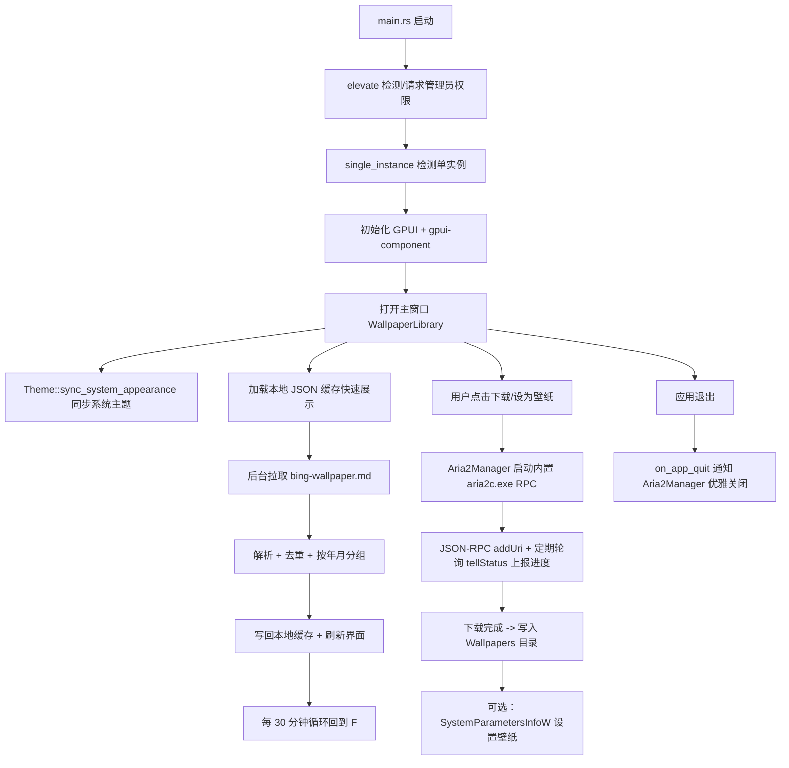

# AGENTS.md — 必应每日壁纸库

本文件面向后续维护本项目的开发者 / AI Agent，说明项目目标、架构设计、关键实现决策、构建与发布流程，以及已知的注意事项。

## 1. 项目简介

**必应每日壁纸库** 是一个 Windows 桌面应用，使用 Rust + [GPUI](https://gpui.rs)（Zed 编辑器同款 GPU 加速 UI 框架）+
[gpui-component](https://longbridge.github.io/gpui-component/zh-CN/) 组件库编写。

功能：

1. 自动获取开源项目 [niumoo/bing-wallpaper](https://github.com/niumoo/bing-wallpaper) 维护的**全部历史必应每日壁纸**（2021-02-01 至今），
   并按"年 / 月"在左侧导航栏中分类展示。
2. 每 30 分钟后台自动检查一次是否有新的一天的壁纸发布，一旦发布立即增量更新本地列表与缓存。
3. 支持将任意一天的壁纸**下载**到本地，或**一键设置为 Windows 桌面壁纸**，下载时有**实时进度条**。
4. 下载引擎基于 [aria2](https://github.com/aria2/aria2) 的 JSON-RPC 接口，并以最高速度（多连接分片）下载。
5. 最终发布物是**单个完全静态链接的 exe**，在全新安装的 Windows 系统上无需安装任何 Visual C++
   运行库、无需联网安装依赖即可直接运行；程序启动时会自动请求管理员权限，且**不会弹出黑色控制台窗口**。
6. 支持**白天 / 夜间（浅色 / 深色）主题**，默认跟随 Windows 系统浅色/深色模式，也可在左下角设置浮层中
   手动固定为白天或夜间模式。
7. **单实例**：重复启动时会自动把已运行的窗口带到前台，而不是打开第二个窗口/第二份 aria2c.exe 进程。
8. 应用图标使用内嵌的多分辨率 `ico/icon.ico`（16~256px），任务栏/标题栏/资源管理器中均显示清晰、无锯齿的
   自定义图标；exe 的"详细信息"属性页中包含版权署名 **© 2023-2026 小南瓜**，界面“关于”弹窗也展示同样的署名。

## 2. 数据源说明（重要）

- 权威数据源：[niumoo/bing-wallpaper](https://github.com/niumoo/bing-wallpaper) 仓库中的两份 Markdown：
  - `zh-cn/bing-wallpaper.md`：中文标题版本，自 v0.2.4 起作为主数据源。
  - `bing-wallpaper.md`：英文标题版本，自 v0.2.5 起作为补全集，用于补齐中文版缺失的历史日期。
- **多镜像回退策略（自 v0.2.1 起，见 `src/fetcher.rs::CHINESE_SOURCE_URLS` / `ENGLISH_SOURCE_URLS`）**：
  `raw.githubusercontent.com` 在中国大陆部分网络环境下经常无法直接访问（需要科学上网），因此中文、英文两组源
  都按顺序依次尝试 jsDelivr CDN 镜像、jsDelivr Fastly 节点、GitHub 官方原始地址。中文主源为：
  1. `https://cdn.jsdelivr.net/gh/niumoo/bing-wallpaper@main/zh-cn/bing-wallpaper.md`（jsDelivr CDN 镜像，优先）
  2. `https://fastly.jsdelivr.net/gh/niumoo/bing-wallpaper@main/zh-cn/bing-wallpaper.md`（jsDelivr 备用节点）
  3. `https://raw.githubusercontent.com/niumoo/bing-wallpaper/main/zh-cn/bing-wallpaper.md`（GitHub 官方原始地址，兜底）

  英文补全集使用同样顺序，但路径为仓库根目录下的 `bing-wallpaper.md`。每组源第一个请求成功的地址即被采用，
  任何一个失败都只记一条 `log::warn!` 并尝试下一个；若中文源成功但英文源失败，则只展示中文源已有范围，
  若中文源失败但英文源成功，则退回英文列表，只有两组源全部失败才对外报错。
  **已知权衡**：jsDelivr 对 GitHub 仓库内容存在数小时级（历史上最长约 12 小时）的 CDN 缓存延迟，但本项目
  本身只每 30 分钟检查一次是否有新的一天壁纸，这点延迟可以接受，换来的是国内绝大多数网络环境下无需 VPN
  即可直接使用。若以后 jsDelivr 出现长期不可用/正确性问题，可在两组 `*_SOURCE_URLS` 中调整顺序或替换镜像。
- 该文件是一份纯文本 Markdown，每天一行，格式形如：

  ```
  2026-07-02 | [埃斯纳神庙穹顶天花板, 埃及 (© Nick Brundle Photography/Getty Images)](https://cn.bing.com/th?id=OHR.TempleEsna_ZH-CN9834689523_UHD.jpg&rf=LaDigue_UHD.jpg&pid=hp&w=3840&h=2160&rs=1&c=4)
  ```

  与英文版相比有两处区别（均不影响现有解析器）：

  1. 图片 URL 中 OHR 文件名里的语言变体是 `_ZH-CN` 而不是 `_EN-US`，但 Bing CDN 实际返回的图片内容完全相同。
  2. 中文文件的**相邻两条记录之间多出一个空行**，英文版则不插空行。`parse_markdown` 本来就会过滤
     `line.is_empty()` 与不以数字开头的行，因此两种格式均能直接兼容。

- 两份文件都按日期**倒序**排列（最新一天在最前面）。`fetch_all` 会先对各自列表按日期去重，再合并：同一日期
  永远优先保留中文记录，只有中文版缺失的日期才追加英文记录，最后再统一按日期倒序排序。因此不会因为同时拉取
  中英文两份列表而让同一天/同一张图片重复出现在界面里。合并后的列表既可以用于首次全量拉取历史，也可以用于
  "取最上面一条日期，与本地缓存的最新日期比较"来判断是否有新的一天发布。
- **已知数据质量问题（解析时必须容错）：**
  - 个别日期存在**两条重复记录**（如 `2025-04-10`、`2025-01-17`、`2024-07-19`、`2024-04-24` 等），
    图片 URL 不同。当前策略是**保留同一天中第一条出现的记录**（`fetcher::dedup_by_date`）。
  - 2023-02-09 之前的记录，图片 URL **不带** `&rf=...&pid=hp&w=3840&h=2160&rs=1&c=4` 查询参数，只是一个裸的
    `.jpg` 链接；解析正则必须同时兼容这两种形式（见 `fetcher::line_regex`）。
  - 中文版文件中少量日期（如 `2025-05-15`）的标题里存在上游数据源留下的 UTF-8 替换字符 `�`
    （部分乱码），不尝试在解析层"修复"，直接展示即可。
- 解析实现：`src/fetcher.rs` 中的 `parse_markdown` / `dedup_by_date` / `merge_entries_prefer_primary` /
  `fetch_all`，并附带单元测试覆盖以上各类情况（现代格式、历史无查询参数格式、同日期去重、中文标题、带空行的
  中文多行样本、中文优先 + 英文补全集合并）。

## 3. 架构与模块划分

```
src/
├── main.rs             程序入口：管理员提权 → 单实例检测 → 初始化 GPUI → 主题同步 → 打开窗口 → 启动后台刷新循环
├── elevate.rs           UAC 管理员权限检测与运行时自我提权（见 §5）
├── single_instance.rs   基于命名互斥体的单实例检测，重复启动时把已运行窗口带到前台（见 §12）
├── paths.rs             应用数据目录、内置 aria2c.exe 的释放逻辑、默认/生效下载目录（见 §6、§12）
├── settings.rs          持久化应用设置（自定义下载路径），JSON 读写（见 §12）
├── model.rs             WallpaperEntry / MonthGroup 数据结构，按年月分组算法，缩略图 URL 转换
├── fetcher.rs           抓取 + 解析中英文 bing-wallpaper.md、中文优先合并、去重、本地 JSON 缓存、"是否有新一天"检测
├── downloader.rs        Aria2Manager：管理内置 aria2c.exe 子进程 + JSON-RPC 客户端（见 §7、§12）
├── wallpaper_setter.rs  调用 Win32 SystemParametersInfoW 设置桌面壁纸
├── updater.rs           检查 GitHub Releases 最新版本，下载 + 自我替换重启（见 §14.3）
└── ui/
    └── mod.rs           主界面：左侧导航栏（主页 + 按年/月分组，支持折叠）+ 右侧内容区域
                         （首页网格视图 / 月份列表视图，预览大图弹窗、设置面板、关于弹窗、
                         新版本提醒弹窗、实时进度条）（见 §12、§14）

ico/
├── icon.ico             内嵌的多分辨率应用图标（16/24/32/48/64/72/96/128/256px）
└── icon.rc              Windows 资源脚本：图标（数字 ID `1`）+ VERSIONINFO 版本/版权信息（见 §10）

build.rs                构建脚本：在 Windows 目标上调用 embed-resource 编译 ico/icon.rc 并链接进最终 exe
```

数据流：



## 4. GPUI / gpui-component 依赖说明

GPUI 目前**没有发布到 crates.io**，只能作为 Git 依赖使用，且与 `gpui-component` 的版本必须匹配（`gpui-component`
自身在其 workspace `Cargo.toml` 中固定了一个兼容的 `gpui` commit）。本项目 `Cargo.toml` 中锁定的版本：

```toml
gpui         = { git = "https://github.com/zed-industries/zed", rev = "1d217ee39d381ac101b7cf49d3d22451ac1093fe" }
gpui_platform = { git = "https://github.com/zed-industries/zed", rev = "1d217ee39d381ac101b7cf49d3d22451ac1093fe", features = ["font-kit"] }
gpui-component = { git = "https://github.com/longbridge/gpui-component", rev = "1505b1487131adbb443f6c69e87847db35bfa2d1" }
gpui-component-assets = { git = "https://github.com/longbridge/gpui-component", rev = "1505b1487131adbb443f6c69e87847db35bfa2d1" }
reqwest_client = { git = "https://github.com/zed-industries/zed", rev = "1d217ee39d381ac101b7cf49d3d22451ac1093fe" }
http_client    = { git = "https://github.com/zed-industries/zed", rev = "1d217ee39d381ac101b7cf49d3d22451ac1093fe" }
```

**升级注意事项**：如果需要升级 `gpui-component` 到更新的 commit，必须同时查看该 commit 时间点
`gpui-component` 仓库根 `Cargo.toml` 里 `[workspace.dependencies]` 下 `gpui = { git = ..., rev = "..." }`
锁定的具体 rev，并将本项目的 `gpui` / `gpui_platform` rev 同步更新为**完全一致**的值，否则会因为两份
`gpui` 版本不兼容导致大量类型不匹配的编译错误。

**为什么不用 `reqwest`（crates.io 版本）直接发请求？** 早期实现里为 `fetcher.rs` 和 `downloader.rs`
（访问本机 aria2 RPC）各自创建了一个独立的 `reqwest::Client`，但 `reqwest`（无论是 crates.io 版本还是
`zed-reqwest`）在底层使用 `hyper-util` 做 DNS 解析等操作时，需要运行在 **Tokio 1.x 运行时**上下文中；
而 GPUI 使用的是自己的（基于 `smol`）异步执行器，并不存在 Tokio reactor，会直接 panic：
`there is no reactor running, must be called from the context of a Tokio 1.x runtime`。
最终方案是统一改用 GPUI/Zed 生态自带的 `http_client::HttpClient` trait（通过 `cx.http_client()` /
`Entity` 的 `Context: AppContext` 拿到 `Arc<dyn HttpClient>`），它是专门适配 GPUI 执行器设计的，不依赖
Tokio。**因此本项目的 `Cargo.toml` 中特意没有直接依赖 `reqwest`，任何新增的网络请求都应该复用
`http_client::HttpClient`，不要再引入独立的 `reqwest::Client`。**

## 5. 管理员权限自动提权

见 `src/elevate.rs`。

`gpui` 自身在 Windows 上有一个 `windows-manifest` feature（默认开启），会通过 `embed-resource` 在编译期把一份
内嵌的 Windows Manifest（`asInvoker` 执行级别）写进最终的可执行文件里。由于这个清单资源的注入是从 `gpui`
crate 自身的 `build.rs` 里完成的、且 `gpui_platform` 在 Windows target 上会强制打开这个 feature，我们**没有
办法**通过下游 crate 简单地"关闭"它；如果我们自己的 `build.rs` 也尝试内嵌一份 `requireAdministrator` 的清单，
会与 `gpui` 已经内嵌的清单在链接期产生资源冲突。

因此本项目改为**运行时自我提权**方案：

1. `main()` 一开始调用 `elevate::ensure_elevated()`；
2. 内部通过 `OpenProcessToken` + `GetTokenInformation(TokenElevation)` 判断当前进程是否已是管理员；
3. 如果不是，调用 `ShellExecuteW` 并使用 `"runas"` 动词重新拉起自身（触发系统 UAC 弹窗），随后**立即返回
   `false`**，`main()` 直接 `return`，让当前这个未提权的进程退出；
4. 用户在 UAC 弹窗中确认后，新拉起的进程会以管理员身份运行，`ensure_elevated()` 检测到已提权，返回 `true`，
   继续正常初始化 GPUI 界面；
5. 如果用户取消了 UAC 弹窗（`relaunch_as_admin()` 返回 `false`），则退化为"以当前权限继续运行"，不会强制
   退出程序（避免用户彻底无法使用软件）。

## 6. 静态链接与 aria2 打包方式

### 6.1 CRT 静态链接

`.cargo/config.toml` 中为 `x86_64-pc-windows-msvc` target 配置了：

```toml
[target.x86_64-pc-windows-msvc]
rustflags = ["-C", "target-feature=+crt-static"]
```

这会把 MSVC 的 C 运行时（`vcruntime` / `ucrt`）静态链接进最终 exe，而不是依赖系统上安装的
`VCRUNTIME140.dll` / `MSVCP140.dll`（这些 DLL 需要用户手动安装"Visual C++ 可再发行组件包"才会存在）。

**已验证**：release 版本 `bing-wallpaper-lib.exe` 用 `dumpbin /dependents` 检查后，依赖列表中只有
`kernel32.dll`、`user32.dll`、`gdi32.dll`、`d3d11.dll`、`dwrite.dll` 等 **Windows 系统自带的 DLL**，
**不包含任何 VC++ 运行库 DLL**，符合"全新系统直接运行不报缺 DLL"的要求。

> 唯一需要注意的系统级依赖是 `icuuc.dll`（ICU 国际化组件），这是 Windows 10 1903 及以上版本、以及全部
> Windows 11 版本自带的系统组件，属于操作系统本身的一部分，不需要额外安装。若未来需要支持更老的 Windows 10
> 版本，需要额外验证该 DLL 的可用性。

### 6.2 aria2c.exe 的打包

用户明确要求下载引擎使用 aria2 的接口。由于本项目追求"发布物是单个 exe"，**没有采用"额外分发一个
aria2c.exe 文件放在同目录"的方案**，而是：

1. 从 aria2 官方 GitHub Release 下载 Windows 64 位预编译版本（当前使用 `aria2-1.37.0-win-64bit-build1.zip`
   中的 `aria2c.exe`），放置在项目的 `assets/aria2c.exe`；
2. `src/paths.rs` 中通过 `include_bytes!("../assets/aria2c.exe")` 把这个二进制**编译期直接嵌入**进我们自己的
   Rust 可执行文件里；
3. 运行时首次需要下载时（`Aria2Manager::start`），`paths::ensure_aria2c()` 会把这份内嵌数据释放到
   `%LOCALAPPDATA%\BingWallpaperLib\bin\aria2c.exe`（如果目标文件不存在或大小不一致才重新写入）；
4. 之后以子进程方式启动这个释放出来的 `aria2c.exe`，加上 `--enable-rpc` 等参数，仅通过本地 HTTP JSON-RPC
   （`http://127.0.0.1:16800/jsonrpc`）与其通信，调用官方支持的 `aria2.addUri` / `aria2.tellStatus` 等接口。

这样最终交付物依然是**单个 exe 文件**，符合"打包成 exe"的要求，同时严格通过 aria2 官方 RPC 接口完成下载，
没有重新发明下载逻辑。发布物通过 GitHub Release 附件分发，详见 §7.3。

**最高速度配置**（在 `Aria2Manager::start` 中通过命令行参数传给 aria2c）：

```
--max-connection-per-server=16
--split=16
--min-split-size=1M
--max-concurrent-downloads=8
--max-overall-download-limit=0   # 不限速
```

**许可证提示**：aria2 使用 **GPL-2.0** 许可证。本项目以"内嵌未修改的官方预编译二进制、仅通过其公开 RPC 接口
调用"的方式使用它，二进制体积不大（约 5.4MB）。如果后续需要商业分发，请自行核实 GPL-2.0 对"内嵌未修改二进制
+ 通过标准接口调用"这种集成方式的合规要求，必要时在发布物中附带 aria2 的许可证文本与源码获取方式说明。

**进程生命周期管理**：`Aria2Manager` 实现了 `Drop`，在其被销毁时会强制终止内置的 `aria2c.exe` 子进程，避免
产生孤儿进程；同时 `shutdown(&self)` 会在应用退出时通过 `App::on_app_quit`（在 `main.rs` 中注册）主动
通过 RPC 通知 aria2 自行退出，二者互为兜底：若 RPC 调用失败或从未调用过 `shutdown`，`Drop` 仍会在进程
退出时强制终止子进程。由于 `shutdown` 只需要 `&self`（不消耗所有权），因此可以直接通过
`WallpaperLibrary` 内部共享的 `Rc<RefCell<Option<Rc<Aria2Manager>>>>` 句柄调用，无需在应用退出时尝试
回收唯一所有权。

## 7. 构建、检查与发布流程

### 7.1 环境要求

- Rust 稳定版工具链，`x86_64-pc-windows-msvc` target（`.cargo/config.toml` 已将其设为默认 `build.target`）。
- **Visual Studio Build Tools**（或完整 VS），且必须包含：
  - "使用 C++ 的桌面开发" 工作负载 / `Microsoft.VisualStudio.Component.VC.Tools.x86.x64` 组件；
  - 对应的 **Windows 10/11 SDK**（提供 `kernel32.lib` 等导入库）。
  - 不需要把 `cl.exe` / `link.exe` 手动加入 `PATH`：Rust 的 MSVC 链接器探测逻辑会自行通过注册表 /
    `vswhere` 定位已安装的 Visual Studio / Build Tools。

### 7.2 日常开发

```powershell
cargo check                          # 快速类型检查
cargo test                           # 运行 fetcher 的解析单元测试
cargo clippy --all-targets -- -D warnings   # 严格 Clippy 检查（本项目要求保持 0 警告）
```

> 首次 `cargo check` / `cargo build` 会克隆 `zed-industries/zed`（体积较大的仓库）与
> `longbridge/gpui-component`，耗时可能长达数分钟到十几分钟，属于正常现象，后续增量构建会快很多。

### 7.3 发布打包

```powershell
cargo build --release
```

产物位于 `target\x86_64-pc-windows-msvc\release\bing-wallpaper-lib.exe`。

**发布物分发方式**：本项目不再把构建产物提交进 Git 仓库（大体积二进制不适合长期存在于 Git 历史中），
而是把 release 构建出的 exe 重命名为 `bing-wallpaper-lib-vX.Y.Z-x64.exe` 后，作为 **GitHub Release** 的
附件上传（`gh release create vX.Y.Z <exe路径> --notes ...`）。仓库根目录不再维护 `dist/` 目录；`README.md`
的"下载使用"一节只指向 Releases 页面的最新版本。应用内置的"检查更新"功能（见 §14.3）也是通过 GitHub
Releases API 判断版本新旧，因此每次发布都必须走 GitHub Release + 打 tag 的流程，不能只更新仓库文件。

`Cargo.toml` 中 `[profile.release]` 已配置：

```toml
[profile.release]
opt-level = 3
lto = true
codegen-units = 1
strip = true
panic = "abort"
```

以获得更小体积与更好性能（代价是增加发布构建耗时）。

## 8. 历史遗留问题与解决方案（已全部修复）

以下 4 项曾是早期版本的已知限制，现已全部修复，保留记录供后续回顾设计思路：

1. **缩略图性能**：已在 `WallpaperEntry::thumbnail_url()`（`src/model.rs`）中实现——对带有 `w=3840&h=2160`
   查询参数的现代记录（2023-02-09 起），把壁纸卡片中展示用的 `img()` 源地址替换为 `w=320&h=180` 的小尺寸
   变体，大幅减少列表滑动时的解码/带宽开销；2023-02-09 之前的记录因为 URL 不带查询参数，无法改变
   分辨率，原样返回。下载/设为壁纸时仍使用 `WallpaperEntry::url` 原始高清地址。
2. **单实例限制**：已在 `src/single_instance.rs` 中实现——使用命名为 `Global\BingWallpaperLib_SingleInstance`
   的全局 `Mutex`，重复启动时通过 `GetLastError() == ERROR_ALREADY_EXISTS` 检测到已有实例在运行，尝试通过
   `FindWindowW`（按窗口标题匹配 `paths::APP_NAME`）+ `SetForegroundWindow` 将其带到前台，然后当前（新）进程
   直接退出（见 §12）。
3. **aria2 优雅关闭未接入应用生命周期**：已将 `Aria2Manager::shutdown(&self)` 通过 `cx.on_app_quit`（`main.rs`）
   接入应用退出流程，见 §6.2 末尾“进程生命周期管理”一段。
4. **下载进度 UI**：已在 `src/ui/mod.rs` 中实现——`run_download` 会以 300ms 间隔轮询 `Aria2Manager::tell_status`，
   把 `completedLength` / `totalLength` 计算出的百分比写入 `WallpaperLibrary::progress`（`HashMap<NaiveDate, f32>`），
   并通过 `cx.notify()` 触发重新渲染；卡片中使用 gpui-component 的 `Progress` 组件（`gpui_component::progress::Progress`）
   实时展示进度条与百分比文本，下载中的按钮会自动禁用（避免重复提交）。

## 9. 图标资源与控制台窗口隐藏

### 9.1 为什么任务栏图标会丢失

`gpui` 自身在 Windows 平台层（`gpui_windows::platform::load_icon()`）会通过 `LoadImageW(module,
PCWSTR(1 as _), IMAGE_ICON, ...)` **按固定的数字资源 ID `1`** 去查找应用图标（用于窗口类/任务栏）。
如果 `.rc` 文件中的图标资源使用的是符号名（如 `IDI_ICON1`）而非数字 `1`，`rc.exe` 会将其编译为一个
**名称键控**的资源，导致 `load_icon()` 找不到对应 ID 而静默失败（`unwrap_or_default()` 返回空 `HICON`），
表现为任务栏/窗口左上角完全没有图标。**因此 `ico/icon.rc` 必须使用字面量数字 ID**：

```rc
1 ICON "icon.ico"
```

若以后需要新增其他图标/位图类资源，请勿使用数字 `1`（已被图标占用）与 `1 VERSIONINFO`（已被版本信息
占用，两者资源类型不同所以不会冲突）占用的 ID。

### 9.2 多分辨率图标生成

`ico/icon.ico` 需覆盖 16/24/32/48/64/72/96/128/256px 共 9 个尺寸，才能在 Windows 不同地方（任务栏、
标题栏、资源管理器大/小图标视图、Alt+Tab 切换器等）都显示清晰、无锯齿的图标，而不是由系统
对单一尺寸位图做缩放。本项目使用 `scripts/generate_ico.ps1`（基于 .NET `System.Drawing`，无需安装
任何额外工具如 ImageMagick）从一张高分辨率源图重新采样生成包含全部 9 个尺寸的标准 ICO 容器（每个尺寸都以
支持 alpha 通道的 PNG 内嵌编码，Windows Vista 及以上均支持）。若以后需要更换图标，可运行：

```powershell
powershell -ExecutionPolicy Bypass -File scripts/generate_ico.ps1 -SourcePath <新图标.ico或.png> -OutputPath ico/icon.ico
```

`scripts/check_ico.ps1` 可用于验证一个 `.ico` 文件实际包含哪些尺寸。

### 9.3 隐藏黑色控制台窗口

`src/main.rs` 顶部使用：

```rust
#![cfg_attr(not(debug_assertions), windows_subsystem = "windows")]
```

仅在 **release 构建** 时把二进制的 Windows 子系统标记为 `windows`（GUI 子系统），从而使最终发布的 exe
启动时不会弹出黑色控制台窗口。**注意：故意用 `cfg_attr(not(debug_assertions), ...)` 而不是无条件地写
`#![windows_subsystem = "windows"]`**——因为该属性是 crate 级别的，`cargo test` 会用同一份 `main.rs` 编译测试
二进制；若无条件开启 `windows` 子系统，测试二进制也会变成 GUI 子系统程序，导致 `cargo test` 无法正常
输出测试结果（进程会安静地“挂住”，不返回任何控制台输出）。`debug_assertions` 在 dev/test 构建中默认开启、
在 `--release` 中默认关闭，恰好区分了这两种场景。

### 9.4 VERSIONINFO 版权信息

`ico/icon.rc` 首行使用 `#pragma code_page(65001)` 声明 UTF-8 编码，以便直接在 `VALUE` 字符串字面量中使用
中文与 `©` 符号，包括 `LegalCopyright "© 2023-2026 小南瓜"`、`ProductName "必应每日壁纸库"` 等字段，
最终会展示在 Windows 资源管理器中 exe 文件属性对话框的“详细信息”标签页中。同样的版权文本也以普通
`SharedString` 常量（`COPYRIGHT`）形式在 `src/ui/mod.rs` 的“关于”弹窗中展示。

> 提示：终端/控制台直接打印这些字段时，`©` 有时会因为 PowerShell 控制台代码页显示为 `?`，这只是
> 显示层问题，实际存储的 Unicode 字符（U+00A9）是正确的（可通过 `[System.Diagnostics.FileVersionInfo]`
> 读取并逐字符检查 `[int][char]` 验证）。

## 10. 主题（白天/夜间模式）

`gpui-component` 自带 `Theme::sync_system_appearance(window: Option<&mut Window>, cx: &mut App)`
（`gpui_component::theme` 模块），内部优先读取 `window.appearance()`（若无窗口则回退到 `cx.window_appearance()`），
把结果传给 `Theme::change(mode, window, cx)`。`gpui_component::init(cx)` 内部默认会先把主题设为 `ThemeMode::Light`，
满足“默认白天主题”的要求；本项目在 `main.rs` 的 `open_window` 回调中，在窗口创建后立即调用一次
`Theme::sync_system_appearance`，若系统当前为深色模式则会覆盖为深色，否则保持默认的浅色。

为了实现“运行时跟随系统主题实时切换”（而不仅仅是启动时检测一次），还使用了 `gpui` 自带的
`Window::observe_window_appearance(callback)` 订阅窗口外观（appearance）变化事件（底层在 Windows 上监听
`WM_SETTINGCHANGE`/主题相关消息）。自 v0.2.6 起，`AppSettings::theme_preference` 允许用户在左下角设置浮层中
选择“跟随系统 / 白天 / 夜间”：只有在“跟随系统”模式下，窗口外观变化回调才会再次调用
`Theme::sync_system_appearance`；若用户手动固定白天或夜间，则系统主题变化不会覆盖用户选择。

## 11. 单实例检测

见 `src/single_instance.rs`。使用 `CreateMutexW(None, false, "Global\\BingWallpaperLib_SingleInstance")`
创建/打开一个全局命名互斥体。第一个启动的进程会成功创建它并一直持有到进程退出（句柄故意不调用
`CloseHandle`，而是用 `std::mem::forget` 让它活到进程结束，由操作系统回收）；后续进程创建同名互斥体时会返回
一个指向已存在对象的句柄，同时 `GetLastError()` 会返回 `ERROR_ALREADY_EXISTS`，据此判断“已有实例在
运行”，此时尝试通过 `FindWindowW(None, APP_NAME)` 找到已运行实例的主窗口并调用 `ShowWindow(SW_RESTORE)` +
`SetForegroundWindow` 将其带到前台，然后新进程直接退出（`main()` 返回，不初始化 GPUI）。

> 注意：`FindWindowW` 按窗口标题精确匹配 `paths::APP_NAME`（即窗口标题栏文字），若以后修改了 `TitlebarOptions`
> 中的 `title`，需同步更新这里的匹配逻辑。

## 12. 首页网格 / 预览弹窗 / 设置面板 / 侧边栏折叠

本节记录本轮新增的四项交互功能的实现方式，以及实现过程中踩到的两个关键坑
（GPUI 对话框渲染时机、内置 aria2c.exe 的黑框闪烁问题），供后续维护参考。

### 12.1 首页网格视图（默认视图）+ 无限滚动

`src/ui/mod.rs` 中的 `WallpaperLibrary` 现在有一个 `view_mode: ViewMode`
字段（`ViewMode::Home` / `ViewMode::MonthDetail`），默认是 `Home`。

- `set_entries` 在刷新 `groups` 的同时，把全部壁纸摊平成一个按日期倒序的
  `flat_entries: Vec<WallpaperEntry>`，供首页网格直接切片使用，避免每次
  渲染都要重新遍历/克隆全部分组。
- 首页网格只渲染 `home_loaded_count`（初始为 `HOME_PAGE_SIZE = 20`）张，
  用 `div().flex().flex_wrap().gap_4()` 实现自适应换行的网格布局。
- 无限滚动：网格外层滚动容器通过 `.track_scroll(&self.home_scroll_handle)`
  绑定一个 `gpui::ScrollHandle`，并用 `.on_scroll_wheel(cx.listener(...))`
  在每次滚轮事件时读取 `scroll_handle.offset()` / `max_offset()`，判断是否
  已接近底部（阈值 `LOAD_MORE_THRESHOLD = 300px`），是则把
  `home_loaded_count` 递增 `HOME_PAGE_SIZE` 并 `cx.notify()`。这个实现只在
  用户实际滚动时才触发一次判断和一次渲染，没有任何定时轮询，足够流畅。
- 点击左侧导航栏的"主页"菜单项（图标 `IconName::GalleryVerticalEnd`）会把
  `view_mode` 设回 `Home`，但**不会清空** `selected_key`；点击某个年/月条目
  会把 `view_mode` 设为 `MonthDetail` 并更新 `selected_key`。因此"主页 →
  某月 → 再回主页 → 再点回该月"时，月份视图会自动恢复到之前浏览的位置，
  不需要额外的状态保存/恢复逻辑。

### 12.2 悬停预览按钮（纯 CSS group-hover，无状态开销）

首页网格每张卡片的图片区域使用 GPUI 的 *group* 机制实现悬停显效，
不依赖任何 `cx.notify()`/应用状态：

- 卡片外层容器调用 `.group(format!("home-card-{date}"))` 声明一个具名分组
  （分组名必须按日期等唯一标识区分，否则多张卡片会互相干扰彼此的悬停状态）。
- 图片下方叠加一个 `.absolute().bottom_0().left_0().right_0()` 的半透明按钮
  条，默认 `.opacity(0.)`，并用
  `.group_hover("home-card-{date}", |style| style.opacity(1.))` 声明"当同名
  分组被悬停时不透明度变为 1"。这个判定完全在 GPUI 的样式解析/绘制阶段完成，
  不会触发额外的 `Context::notify` 或重新渲染，因此鼠标划过网格时非常流畅。

月份列表视图（旧版）里的卡片则直接在"下载"按钮右侧常驻展示一个"预览图片"
按钮，不使用悬停效果（用户需求里只要求首页网格使用悬停展示）。

### 12.3 预览大图：基于 `gpui_component::dialog` 的弹窗；设置面板为左下角浮层

两个弹窗都通过 `window.open_dialog(cx, move |dialog, _window, cx| { ... })`
（`gpui_component::WindowExt` trait）按需创建，而不是常驻组件：

- **预览弹窗**（`WallpaperLibrary::open_preview_dialog`）：展示原始高清大图
  （`entry.url`，不是缩略图）+ 标题，底部 `DialogFooter` 提供"下载"/"设为
  桌面壁纸"按钮，点击后复用已有的 `start_download`/`set_as_wallpaper` 方法
  并立即 `window.close_dialog(cx)`。
- **设置弹窗**（`WallpaperLibrary::open_settings_dialog`）：一个
  `gpui_component::input::InputState` 文本框用于手动输入/编辑下载保存路径，
  配一个"在资源管理器中打开"按钮（`std::process::Command::new("explorer")`）
  和一个"保存"按钮（写入 `AppSettings` 并持久化，见 §12.5）。

> **⚠️ 关键坑：`gpui_component::Root` 不会自动渲染已打开的对话框/通知/
> Sheet。** `Root::render()`（`root.rs`）本身只画 `self.view`（也就是我们的
> `WallpaperLibrary`）+ tooltip/菜单遮罩层，`active_dialogs` / `active_sheet`
> / 通知队列虽然会被 `open_dialog`/`open_sheet`/`push_notification` 正确写入
> `Root` 的状态，但**必须由业务代码自己**在顶层视图的 `render()` 里手动加上：
> ```rust
> .children(Root::render_dialog_layer(window, cx))
> .children(Root::render_notification_layer(window, cx))
> ```
> （参考 gpui-component 仓库自带的 `examples/dialog_overlay/src/main.rs`。）
> 本项目一开始漏掉了这一步，导致点击"预览图片"/设置按钮后 `open_dialog`
> 调用本身没有报错、状态也确实写入了，但界面上完全没有任何反应（因为没人把
> `active_dialogs` 画出来）。修复方式是让 `WallpaperLibrary::render` 的
> `_window` 形参从占位符改为真正使用的 `window`，并在返回的元素树末尾追加
> 上面两行 `.children(...)`。

> **⚠️ 关键坑：对话框 builder 闭包里不能 `.read()`/`.update()` 正在渲染它
> 自己的那个 Entity（会直接 panic 崩溃）。** `render_dialog_layer` 是从
> `WallpaperLibrary::render()` 内部调用的，也就是说对话框的 `build` 闭包是
> **在 `WallpaperLibrary` 自身处于"正在被渲染/更新"状态期间**被执行的。如果
> 这个闭包里又通过 `cx.entity()` 捕获的 `view: Entity<WallpaperLibrary>` 去
> 调用 `view.read(cx)`（哪怕只是读一个字段），GPUI 的 entity 借用检查会立刻
> panic：`cannot read bing_wallpaper_lib::ui::WallpaperLibrary while it is
> already being updated`，表现为点击"预览图片"后应用直接闪退。修复方式是把
> 任何需要从 `self` 读取的数据（例如按钮要不要禁用的 `downloading` 状态）
> **在调用 `window.open_dialog` 之前**、还处于普通的 `&self` 方法体中时就
> 提前计算好并按值捕获进闭包，闭包内部只使用这个快照值，不再对 `view`
> 做任何 `.read()`（`.update()`/触发下载等操作仍然可以在按钮的 `on_click`
> 里对 `view` 调用，因为那是在一次新的、独立的点击事件分发中执行的，不会跟
> 渲染过程重入冲突）。详见 `WallpaperLibrary::open_preview_dialog` 的实现
> 与函数文档注释。

### 12.4 侧边栏折叠

`gpui_component::sidebar` 本身就内置了折叠支持，不需要手写宽度动画：

- `Sidebar::new("main-sidebar").collapsible(SidebarCollapsible::Icon)`
  声明折叠模式为"收起为纯图标窄栏"（另外两种是 `Offcanvas` 整体滑出和
  `None` 禁用折叠）。
- `.collapsed(self.sidebar_collapsed)` 由 `WallpaperLibrary` 自己的
  `sidebar_collapsed: bool` 字段驱动。
- 侧边栏头部内置了现成的 `SidebarToggleButton`（自带
  `IconName::PanelLeftOpen`/`PanelRightOpen` 两种状态图标，不是 emoji），
  点击时切换 `sidebar_collapsed` 并 `cx.notify()`；宽度变化由 `Sidebar`
  内部动画完成。
- 收起状态下，侧边栏头部的软件名称/副标题会通过 `.when(!sidebar_collapsed, |this| ...)` 隐藏，只保留
  图标按钮，避免窄栏下文字挤压换行。侧边栏底部不再展示版权文字，版权信息统一放在“关于”弹窗。

### 12.5 设置系统与自定义下载路径 / 主题偏好 / 清空缓存

新增 `src/settings.rs`：`AppSettings { download_dir: Option<PathBuf>, theme_preference: ThemePreference }`，
以 JSON 形式持久化到 `app_data_dir()/settings.json`（复用 `paths::app_data_dir`）。

- `paths::wallpapers_dir()` 现在委托给
  `AppSettings::load().effective_download_dir()`：若用户设置了自定义路径则
  使用并确保目录存在，否则回退到原来的默认路径（现拆分为新函数
  `paths::default_wallpapers_dir()`）。
- 保存设置时（`WallpaperLibrary::apply_download_dir`），若 aria2 常驻进程
  已经启动，会额外调用新增的 `Aria2Manager::change_download_dir`（基于
  `aria2.changeGlobalOption` RPC，见 `src/downloader.rs`）让新目录立即对
  **之后新提交**的下载任务生效（已经在进行中的任务不受影响，这是
  aria2 自身该 RPC 方法的行为限制，不是本项目的簡化）。
- 自 v0.2.9 起，“选择并保存”会调用 `src/folder_picker.rs` 中基于 Windows `IFileOpenDialog` +
  `FOS_PICKFOLDERS` 的系统文件夹选择窗口，让用户直接选择壁纸下载目录；选择成功后会同步更新输入框、写入
  `settings.json`，并通过 `Aria2Manager::change_download_dir` 让后续下载立即使用新目录。文本输入框仍保留，
  用于展示当前路径和兼容手动粘贴。
- 自 v0.2.6 起，设置入口不再打开居中对话框，而是在主界面左下角（侧边栏设置按钮上方）渲染一个类似抖音的
  侧边栏浮层；浮层中包含下载路径、主题偏好（跟随系统/白天/夜间）、清空壁纸缓存、检查更新、关于软件。
- “清空壁纸缓存”只删除 `paths::cache_file()` 对应的本地 JSON 缓存文件，不清除当前内存中已展示的列表；下次后台
  刷新或重启后会重新从远端数据源拉取并写回缓存。
- 自 v0.2.12 起，收藏列表保存到 `paths::favorites_file()`（`favorites.json`），内部只记录 `NaiveDate` 日期集合；
  左侧导航栏“我的收藏”按日期倒序展示收藏壁纸。设置浮层的批量下载支持“全部历史 / 当前月份 / 收藏”，会跳过已存在的
  `WallpaperEntry::file_name()` 目标文件。

### 12.6 内置 aria2c.exe 的黑色控制台窗口闪烁

即使 `Aria2Manager::start` 已经把子进程的 `stdin`/`stdout`/`stderr` 全部
重定向到 `Stdio::null()`，Windows 仍然会在**没有父进程控制台可继承**的
情况下（本项目 release 构建是 `windows_subsystem = "windows"`，没有任何
控制台）为这个控制台子系统程序（`aria2c.exe`）短暂新建一个黑色控制台
窗口再立即被我们的重定向掩盖内容——但窗口本身仍然会闪烁可见。修复方式是在
`Command::spawn` 之前，通过 `std::os::windows::process::CommandExt::
creation_flags` 传入 `CREATE_NO_WINDOW`（`0x08000000`）标志，让系统压根
不为该子进程创建控制台，从根源上消除闪烁（而不是设法把已创建的窗口隐藏）。

### 12.7 侧边栏底部悬停动画范围过大 / 折叠后子项无法点击 / 原生标题栏与内容区颜色不一致

本轮修复的三个体验问题，记录实现方式与根因供后续参考：

**① 设置按钮悬停时出现两层叠加动画。** 根因是 `gpui_component::sidebar::SidebarFooter`
这个组件本身的 `RenderOnce::render`（`crates/ui/src/sidebar/footer.rs`）内部把整个
footer 包了一层 `h_flex().hover(|this| this.bg(...))`——也就是说只要鼠标移动到
"整个 footer 区域"（哪怕是空白处），就会触发一次背景高亮动画；而 footer 里的
设置按钮自身（`Button::new(...).ghost()`）又有一层自己的 hover 高亮，两者叠加导致
"先出现一大块高亮，再出现按钮自身高亮"的观感。**修复方式**：不再使用
`SidebarFooter::new()` 包装内容，而是直接把一个普通的 `v_flex()`（自己控制
`gap_2()`/`p_2()`/`w_full()` 排版）传给 `Sidebar::footer(...)`——`footer()` 方法
签名是 `fn footer(mut self, footer: impl IntoElement) -> Self`，本来就不要求
必须传 `SidebarFooter`，所以这样替换是安全的。这样 footer 区域不再有整体 hover
背景，只保留设置按钮自身的悬停反馈。

**② 侧边栏折叠为纯图标模式后，年份日历图标点击没有任何反应。** 这不是
 bug，而是这些图标本身代表的是"年份分组"（`SidebarMenuItem` 的
`children(month_children)`），点击后的默认行为是展开/收起子级月份列表，但
折叠模式下子级本来就不可见/不可展开，所以看起来像是"点了没反应"。由于
"年份"本来就不是一个可以直接跳转的目标页面（真正可导航的是它的子级
"月份"），修复方式采用用户建议的第二种方案：**折叠状态下直接隐藏整个
"归档"分组**（`SidebarGroup::new("归档").child(sidebar_menu)`），只保留
"导航"分组下的"主页"和 footer 里的"设置"两个始终可点击、语义明确的图标按钮。
实现为 `Sidebar` 链式调用上的 `.when(!sidebar_collapsed, |this| this.child(...))`
（`FluentBuilder::when`，`Sidebar` 本身满足 `Sized` 约束，可以直接链式使用）。

**③ 原生 Windows 标题栏颜色与下方内容区背景色不协调（白天/夜间两套主题
下都存在）。** 根因是 `main.rs` 中最初的 `TitlebarOptions { appears_transparent:
false, .. }` 会让 Windows 绘制**系统原生的标题栏**，其颜色由 Windows 自身的
非客户区主题决定，与我们应用内部 `cx.theme().background` 的配色**是两套完全
独立的颜色系统**，因此无法做到"沉浸色"一致。**修复方式**：
1. `main.rs` 中把 `appears_transparent` 改为 `true`（不再让 Windows 绘制原生
   标题栏，转为"客户区标题栏"模式），但**仍然保留 `title: Some(APP_NAME)`
   不变**——`title` 字段同时也是任务栏/Alt+Tab 显示的窗口名，也是
   `src/single_instance.rs` 里 `FindWindowW` 精确匹配已运行实例的依据，如果
   连带把它设为 `None`（`gpui_component::TitleBar::title_bar_options()` 默认
   给的值）会导致窗口标题变成空字符串，进而破坏单实例检测；这两个字段
   在 `gpui_windows` 的窗口创建逻辑（`WindowsWindow::new`）里是完全独立读取的，
   可以只改 `appears_transparent` 而不改 `title`。
2. `src/ui/mod.rs` 的 `WallpaperLibrary::render` 顶层改为
   `v_flex().size_full().bg(cx.theme().background)
   .child(title_bar).child(main_row)`（`main_row` 就是原来的
   "侧边栏 + 右侧内容" 那个 `h_flex`，现在改为 `flex_1().min_h_0().w_full()`），
   其中 `title_bar` 是 `gpui_component::TitleBar::new().child(...)`
   （`TitleBar` 已通过本文件顶部的 `use gpui_component::*;` 引入，无需额外
   `use`）。`TitleBar` 自己的 `RenderOnce` 实现（`crates/ui/src/title_bar.rs`）
   默认背景色是 `cx.theme().tokens.title_bar`，其 schema 定义
   （`crates/ui/src/theme/schema.rs`）里明确写着
   `apply_background_color!(title_bar, fallback = tokens.background)`——也就是说
   只要主题没有单独覆盖 `title_bar.background`，它就会自动回退成和内容区
   完全相同的 `background` 颜色，天然满足"沉浸色"一致的要求，白天/夜间两套
   主题都无需手工设置颜色即可自动生效。`TitleBar` 同时自带了 Windows 下的
   最小化/最大化/关闭按钮绘制（`WindowControls`，内部通过
   `window_control_area(...)` 让 Windows 按系统标准处理这些区域的点击，
   不需要我们自己写点击逻辑）。

## 14. 首页回顶按钮/右侧滚动条、关于弹窗、自动检测更新

本轮新增三项功能的实现方式，供后续维护参考。

### 14.1 首页右侧滚动条 + 回到顶部按钮

`gpui_component::scroll::ScrollableElement`给 `Div`/`Stateful<E>` 提供了 `.vertical_scrollbar(&handle)`
方法，内部实现为向 `self` 追加一个绝对定位的滚动条子元素，因此调用它的容器自身（或祖先）
必须处于 `.relative()` 定位上下文中。

`render_home_view` 现在把原来单一的 `#home-scroll` div 包了一层新的 `#home-scroll-wrap`
（`.relative().flex_1().min_h_0()`），内层仍是原来的滚动容器（改为 `.size_full()`，因为 `.flex_1()`
现由外层 wrap div 提供），外层 wrap div 再追加两个兄弟元素：

1. `.vertical_scrollbar(&self.home_scroll_handle)` —— 右侧可拖动的滚动条，`ScrollHandle` 本身
   就实现了 `ScrollbarHandle` trait，无需额外包装。
2. 一个绝对定位在右下角（`.absolute().bottom_6().right_6()`）的半透明“回到顶部”按钮
   （`IconName::ArrowUp` + `.ghost().opacity(0.6)`），点击时调用
   `self.home_scroll_handle.set_offset(point(px(0.), px(0.)))` 将滚动偏移重置为零。

### 14.2 设置面板中的“关于”弹窗

`render_settings_panel` 的左下角浮层中包含“检查更新”、“关于软件”等按钮。点击“关于软件”会调用自由函数
`open_about_dialog(window, cx)`（不需要 `&self`，因此放在 `impl WallpaperLibrary` 块外面），内部再调用
`window.open_dialog` 弹出独立对话框，展示：

- 软件名称（`paths::APP_NAME`）+ 当前版本号（`updater::CURRENT_VERSION`）；
- 一句简介 + 一个版本/版权信息卡片；
- 致谢开源项目一句话 + 两个短标签 `.outline()` 按钮（“数据源项目”/“项目主页”），点击通过
  `cx.open_url(...)` 打开对应 GitHub 页面，避免在界面中直接展示过长 URL；
- 底部 `DialogFooter` 只有一个“关闭”按钮，调用 `window.close_dialog(cx)`。

因为 `Root.active_dialogs` 是 `Vec`（堆栈），从设置浮层里的按钮再弹出关于对话框完全安全，会盖在主界面之上，
不需要额外处理堆栈关系。

> **⚠️ 关键坑（自 v0.2.2 修复）：不要为了拿到 `&mut Window` 而先 `window.update(cx, |_, window,
> app_cx| { view.update(app_cx, ...) })` 包一层。** `WindowHandle<Root>::update` 内部会先对
> `Root` 这个 Entity 加锁（lease），如果在它的闭包里面又间接调用了任何会再次对 `Root`
> 加锁的函数（最典型的就是 `window.open_dialog(...)` / `window.push_notification(...)` /
> `window.close_dialog(...)` 等 `gpui_component::WindowExt` 方法，它们内部都是通过 `Root::update`
> 实现的），就会触发 GPUI 的同一 Entity 重入锁定 panic（`cannot update
> gpui_component::root::Root while it is already being updated`），而 release 构建下
> `panic = "abort"` 会让进程直接静默退出（表现为“卡死闪退”，不会有任何弹窗/日志）。
>
> 这个 bug 实际发生在 `main.rs` 的 `check_update_once`（启动 3 秒后自动静默检查更新的那个后台
> 任务）中：它先用 `window.update(cx, |_, window, app_cx| { view.update(app_cx, |this, cx| {
> this.open_update_dialog(...) }) })` 拿到 `window`，结果 `open_update_dialog` 内部又调用了
> `window.open_dialog(...)`，两次嵌套对 `Root` 加锁，只要本地版本号比 GitHub 最新 Release 旧（从而
> 真的会命中 `Ok(Some(release))` 分支）就必现，与用户是否点击设置按钮无关。**修复方式**：
> 改为直接对 `view.downgrade()` 得到的 `WeakEntity<WallpaperLibrary>` 调用 `update_in(cx, |this,
> window, cx| { this.open_update_dialog(...) })`——`WeakEntity::update_in` 内部通过
> `cx.with_window(entity.entity_id(), ...)` 自行定位 entity 所在的窗口并取得 `&mut Window`，
> 只会对 `WallpaperLibrary` 自身加锁，不会碰 `Root`，与 `open_dialog` 内部的加锁不会冲突。
> 这也是 `ui/mod.rs` 里 `check_for_updates`（设置面板里“检查更新”按钮触发的那个，一直没有
> 这个 bug）已经在用的正确模式：通过 `cx.spawn_in(window, async move |this, cx| { ...;
> this.update_in(cx, |this, window, cx| ...) })` 拿到的 `this` 本来就是 `WeakEntity<Self>`，从没
> 先经过 `Root` 就直接更新自己。**经验教训**：任何需要在异步任务中同时拿到 `&mut Window` 与
> `&mut Context<Self>` 的地方，都应该优先用 `Entity`/`WeakEntity` 自身的 `update_in`，而不是先
> `WindowHandle<Root>::update`/`Root::update` 拿到 `window` 再嵌套调用另一个会碰 `Root` 的方法。

### 14.3 自动检测 GitHub 新版本 + 一键下载升级

新增 `src/updater.rs`，不引入任何新的 crates.io 依赖（手写了一个极简的 `parse_version` 解析
`major.minor.patch` 元组并比较大小，不引入 `semver` crate）：

- `CURRENT_VERSION = env!("CARGO_PKG_VERSION")`，在编译时从 `Cargo.toml` 的 `package.version` 取值。
- `check_for_update(http)` 请求 GitHub 公开 REST API
  `GET https://api.github.com/repos/pandaligx/bing-wallpaper-lib/releases/latest`（需带
  `Accept: application/vnd.github+json` 请求头，无需认证），解析 `tag_name`（如 `v0.2.0`）与当前
  版本比较，找到第一个 `.exe` 结尾的 asset 作为下载目标，返回 `Ok(None)` 表示已是最新。
- **下载新版本改走 aria2（自 v0.2.3）**：之前的 `download_asset(http, release)` 直接用 `http_client` 发 GET
  的写法已经删除。GitHub 的 release asset URL 会 302 重定向到一个带签名参数的
  `release-assets.githubusercontent.com` 地址，reqwest 处理这个重定向链经常直接返回
  400 Bad Request（开不开 VPN 都一样）。现在都交给 UI 层的 `ui/mod.rs::run_update_download`
  通过 `Aria2Manager::add_uri_to_dir(url, dir, filename)` 提交给内置的 `aria2c.exe`，后者处理重定向
  链的健壮性高很多。`downloader.rs` 为此新增了 `add_uri_to_dir` 方法（相对 `add_uri` 额外
  接受 `dir` 参数），避免把非壁纸文件下载到用户配置的壁纸目录。`updater::update_dir()`
  目录则变成 `pub`（仍为 `%LOCALAPPDATA%\BingWallpaperLib\update`），供 UI 层拼 `--dir` 参数使用。
- **更新包镜像直链模板（自 v0.2.9）**：`updater.rs::UPDATE_MIRROR_URL_TEMPLATE` 已配置为
  `https://www.lgxng.cn/1814328088/g/new/soft/{asset}`，下载新版本 exe 时会优先使用该直链，避免 GitHub asset
  下载不可达问题；若构建时设置环境变量 `BING_WALLPAPER_UPDATE_MIRROR_URL`，则环境变量优先。模板支持
  `{version}`（如 `0.2.10`）、`{tag}`（如 `v0.2.10`）、`{asset}`（如 `bing-wallpaper-lib-v0.2.10-x64.exe`）
  三个占位符。检测新版本仍走 GitHub Releases API，以确保版本号、更新说明与发布页链接保持权威；只有实际 exe
  下载 URL 会优先替换为镜像直链。
- **下载进度弹窗（自 v0.2.3）**：`ui/mod.rs::open_update_progress_dialog` 在点击“立即更新”后
  弹出一个新的对话框，展示 `Progress` 进度条 + 已下/总字节（`format_bytes` 二进制前缀） +
  百分比 + 实时速度 + 剩余时间（`format_duration`）。后台任务 `run_update_download` 每 300ms 拉
  aria2 的 `tellStatus`，把 `completedLength`/`totalLength`/`downloadSpeed` 写入共享的
  `WallpaperLibrary::update_progress: Rc<RefCell<Option<UpdateProgress>>>`，并 `cx.notify()`
  触发重新渲染；弹窗 builder 闭包每次重渲染从同一份 `Rc<RefCell<_>>` 引用里读取最新值。
  弹窗内部**切勿**直接 `.read()` `WallpaperLibrary` 自身（会触发 GPUI entity 重入锁定 panic），
  这也是为什么进度状态采用一个 **独立于 `WallpaperLibrary` 之外**的共享句柄来传递。
- `spawn_relaunch(new_exe)` 是整个机制的核心：**Windows 下进程无法覆盖正在运行的自身 exe
  文件**，因此必须借助一个独立的辅助进程来完成替换。具体做法是写出一个 `apply_update.bat`
  脚本（与下载到的新 exe 同目录），内容依次为：`ping -n 4` 延迟 ≈ 3 秒（等待旧进程退出）
  → `copy /Y` 重试循环（最多 15 次，每次间隔 `ping -n 2`）→ `start "" target` 重新启动新 exe →
  自我删除下载缓存与脚本本身。启动这个脚本时复用了 `downloader.rs` 中已验证过的
  `CREATE_NO_WINDOW`（`0x0800_0000`）方法避免闪现黑色控制台窗口。调用方在 `spawn_relaunch` 成功
  后立即调用 `cx.quit()` 优雅退出，由脚本接管完成实际替换与重启。

集成到 UI 与启动流程：

- `main.rs` 在首屏壁纸列表后台刷新循环启动后，另外 `cx.spawn` 一个**一次性**任务：延迟 3 秒
  后调用 `check_update_once`，静默检查一次更新，发现新版本时弹出对话框，未发现或失败时只
  记一条 `log::warn!`，不打扰用户。
- 设置面板中的“检查更新”按钮调用 `WallpaperLibrary::check_for_updates(manual: true, ...)`，
  `manual` 为 `true` 时会用 `window.push_notification(...)` 提示“已是最新版本”/“检查失败”，
  而启动时的自动检查（`manual = false`）不会。
- 发现新版本后弹出的 `open_update_dialog` 提供“查看更新内容”（跳转到 Release 页面）、
  “稍后再说”/“立即更新”两个按钮，点击“立即更新”后调用 `start_update` 开始下载，下载完成
  后自动退出并重启。

> **⚠️ 已知遗留问题：自动更新检查在无 VPN 的中国大陆网络环境下可能失败。**
> `fetcher.rs` 抓取壁纸列表已通过 §2 所述的 jsDelivr 多镜像回退策略解决了 China 可访问性问题，
> 但 `updater.rs` 目前仍然只请求 `api.github.com`（Releases API）与 GitHub 官方的 release asset
> 下载地址（`objects.githubusercontent.com`），两者都**没有**镜像回退。`api.github.com` 有时在国内可以
> 直连，但不稳定；asset 下载地址的可访问性历史上也时好时坏。如果用户反馈“检查更新”/自动更新在关闭
> VPN 时报错，这是一个独立于壁纸列表抓取的、尚未修复的问题，需要单独设计方案（例如：把 Releases
> 元数据或 exe 附件同步镜像到 Gitee Releases，或接入一个国内可访问的 GitHub 反向代理）。

**版本号约定**：每次发布新 GitHub Release 时，必须同步带上 `Cargo.toml` 中 `package.version`
的提升（否则内置的检查更新就会因为“当前编译版本号 = 最新 Release 版本号”而报告为“已是最新
版本”），且 Release 附件中必须包含一个 `.exe` 文件供 `check_for_update` 自动识别下载。

## 13. 关键文件速查

| 文件 | 作用 |
| --- | --- |
| `Cargo.toml` | 依赖与 release profile 配置 |
| `.cargo/config.toml` | 强制 `x86_64-pc-windows-msvc` + CRT 静态链接 |
| `build.rs` | 构建时嵌入 `ico/icon.rc`（图标 + 版本信息） |
| `assets/aria2c.exe` | 内嵌的 aria2 官方预编译二进制（GPL-2.0） |
| `ico/icon.ico` | 多分辨率（16~256px）应用图标 |
| `ico/icon.rc` | Windows 资源脚本：图标（数字 ID `1`）+ VERSIONINFO |
| `scripts/generate_ico.ps1` | 从源图重新生成多分辨率 `icon.ico` 的工具脚本 |
| `scripts/check_ico.ps1` | 检查 `.ico` 文件实际包含的尺寸列表 |
| `src/main.rs` | 程序入口（提权 + 单实例 + 主题同步 + 优雅关闭） |
| `src/elevate.rs` | 运行时 UAC 自我提权 |
| `src/single_instance.rs` | 基于命名互斥体的单实例检测 |
| `src/paths.rs` | 应用数据目录 + 内置 aria2c.exe 释放逻辑 |
| `src/favorites.rs` | 收藏壁纸日期集合的 JSON 持久化 |
| `src/folder_picker.rs` | Windows 系统文件夹选择窗口（选择壁纸下载目录） |
| `src/model.rs` | 数据模型与按年月分组，缩略图 URL 转换、下载文件名生成 |
| `src/fetcher.rs` | 抓取/解析/缓存/增量检测 |
| `src/downloader.rs` | aria2 子进程管理 + JSON-RPC 客户端 |
| `src/wallpaper_setter.rs` | Win32 设置桌面壁纸 |
| `src/updater.rs` | 检查 GitHub Releases 最新版本 + 下载 + 自我替换重启（见 §14.3） |
| `src/ui/mod.rs` | 主界面（侧边栏 + 壁纸网格 + 进度条 + 版权署名） |
