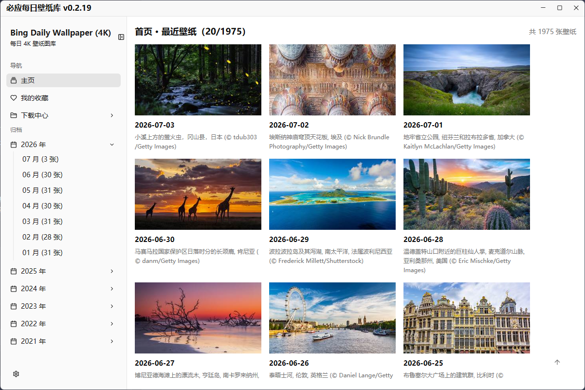

# 必应每日壁纸库

<p align="center">
  
</p>

<p align="center">
  <a href="https://github.com/pandaligx/bing-wallpaper-lib/releases/latest"></a>
  <a href="https://github.com/pandaligx/bing-wallpaper-lib/releases/latest"></a>
  <a href="#下载使用"></a>
  <a href="Cargo.toml"></a>
  <a href="LICENSE"></a>
  
</p>

一款基于 [Rust](https://www.rust-lang.org/) + [GPUI](https://gpui.rs)（Zed 编辑器同款 GPU 加速 UI 框架）与
[gpui-component](https://longbridge.github.io/gpui-component/zh-CN/) 组件库编写的 Windows 桌面应用，自动获取
[zxyongyo/bing-daily-wallpaper](https://github.com/zxyongyo/bing-daily-wallpaper) 归档的**全部历史必应每日壁纸**，
并用 Bing 官方 API 补强最近数据，按年 / 月分类展示，支持一键下载 / 设为桌面壁纸、中文标题展示、每日自动壁纸、后台常驻与自动检查更新。

## 目录

- [功能特性](#功能特性)
- [界面预览](#界面预览)
- [下载使用](#下载使用)
- [从源码构建](#从源码构建)
- [数据来源](#数据来源)
- [下载引擎](#下载引擎)
- [项目文档](#项目文档)
- [许可证](#许可证)

## 功能特性

| | |
|---|---|
| 📅 **全部历史壁纸** | 自动拉取 zxyongyo/bing-daily-wallpaper 归档的每日必应壁纸，优先访问本项目 Gitee 国内镜像，失败后回退 jsDelivr/GitHub，左侧导航栏按年 / 月分类，可折叠收起；内置快照和人工核验修正表会自动补齐旧缓存、远程源缺失的历史日期。 |
| 🔄 **自动增量更新** | 每 30 分钟检查一次是否有新的一天壁纸发布，检测到后自动更新列表与本地缓存。 |
| 🖼️ **首页网格视图** | 默认展示最近壁纸网格，使用虚拟列表按可见区域渲染，右侧可拖动滚动条 + 右下角“回到顶部”按钮；点击图片可放大预览，悬停按钮可直接设为桌面壁纸并收藏。远程缩略图使用 LRU 图片缓存，长距离滚动后不会把所有已浏览图片长期保留在内存中。 |
| ⬇️ **高速下载引擎** | 基于 [aria2](https://github.com/aria2/aria2) 的 JSON-RPC 接口，多连接分片、不限速，下载时有实时进度条。下载文件名会保留日期、Bing 短标题、景物地点信息，并自动清理 Windows 非法字符。 |
| 🧭 **全局分辨率** | 左侧导航栏可选择“原图 UHD / 4K-3840×2160 / 2K-2560×1440 / 1K-1920×1080”，默认 4K；下载壁纸、批量下载和一键设置桌面壁纸都会使用当前选择。 |
| 🖥️ **一键设置桌面壁纸** | 通过 Windows 桌面壁纸 API 设置壁纸，支持同步全部显示器或只设置某一个显示器。 |
| ❤ **我的收藏** | 左侧导航栏新增“我的收藏”，首页和归档列表可用固定尺寸心形图标收藏/取消收藏壁纸。 |
| 📥 **下载中心** | 左侧导航栏新增“下载中心”，包含“批量下载”（全部历史 / 当前月份 / 收藏 / 日历式日期范围选择）与“已下载的壁纸”（磁盘小尺寸缩略图画廊，显示图片分辨率与文件大小，点击图片可预览大图并直接设为桌面壁纸，支持单个或勾选批量删除）两个子页面；4K 原图在后台串行解码，避免画廊滚动时内存持续增长。 |
| 🤖 **每日自动壁纸** | 可设置每天固定时间自动更换壁纸，来源支持“每日最新壁纸”“随机全部历史”“随机我的收藏”；到点后后台快速检查执行，下载或设置失败会自动重试。 |
| 🧩 **后台常驻 / 开机自启** | 支持系统托盘右键菜单，可从托盘打开主窗口、切换开机自启、切换每日自动壁纸或立即更换一次壁纸；开机自启后静默驻留托盘，不显示主页面。 |
| ⚙️ **设置面板** | 左下角设置浮层为左侧分组列表 + 右侧详情的双栏布局，可配置下载路径、外观模式、多显示器壁纸目标、自动壁纸、后台常驻和维护功能；重要错误/警告会以醒目的提示条展示。 |
| 🆕 **一键检测更新** | 启动时自动检测 Gitee / GitHub Releases 是否有新版本发布，设置面板也可手动检查；只接受规范命名的 exe 附件并校验 PE 文件头与大小，更新包下载完成后覆盖当前程序原路径并自动重启。 |
| 🧹 **图片缓存自动清理** | 预览弹窗使用 1080p 图片并在关闭后释放独立缓存；窗口最小化到托盘时会清理主页 / 月份列表的远程缩略图缓存，降低后台常驻内存占用。 |
| ℹ️ **关于面板** | 设置浮层中的“关于软件”展示当前版本号、版权信息、数据源项目与本项目仓库入口。 |
| 🌗 **白天 / 夜间主题** | 默认跟随 Windows 系统深色 / 浅色模式，也可在设置浮层中手动固定为白天或夜间模式。 |
| 🪟 **沉浸式标题栏** | 自绘客户区标题栏，颜色与内容区背景保持一致，深浅两套主题下都不会有原生标题栏"跳色"的问题。 |
| 📦 **完全静态链接** | 发布的 exe 使用 `+crt-static` 静态链接 CRT，全新安装的 Windows 系统上无需安装任何 Visual C++ 运行库即可直接运行；同时内嵌 aria2c.exe，无需额外安装/联网下载任何依赖。 |
| 🔒 **单实例 + 自动管理员提权** | 重复启动会自动把已运行的窗口带到前台；启动时自动请求管理员权限。 |
| 🎨 **多分辨率图标** | 任务栏 / 标题栏 / 资源管理器均显示清晰无锯齿的自定义图标（16~256px）。 |
| 🚫 **无黑色控制台窗口** | 无论是软件本体还是内置的 aria2c.exe 下载引擎子进程，均不会弹出黑色控制台窗口。 |

## 界面预览

<p align="center">
  
  <br/>
  <sub>首页网格视图：默认展示最近壁纸，使用虚拟列表按可见区域渲染；左侧按年 / 月归档，左下角设置浮层为左侧分组列表 + 右侧详情的双栏布局</sub>
</p>

## 下载使用

国内用户可优先从 **[Gitee Releases](https://gitee.com/pandaligx/bing-wallpaper-lib/releases)** 下载最新的
`bing-wallpaper-lib-vX.Y.Z-x64.exe`，海外或 GitHub 可访问环境也可以从
**[GitHub Releases](https://github.com/pandaligx/bing-wallpaper-lib/releases/latest)** 下载同名附件。
下载后双击即可运行，无需安装任何其他依赖，启动时会自动请求管理员权限。
软件内置检查更新功能（设置浮层中），会优先从 Gitee Release 获取更新包，失败后回退 GitHub Release。
开启开机自启后，软件会静默进入系统托盘，用户需要时可从托盘菜单打开主窗口。

## 从源码构建

### 环境要求

- Rust 稳定版工具链，`x86_64-pc-windows-msvc` target（仓库 `.cargo/config.toml` 已将其设为默认 `build.target`）。
- Visual Studio Build Tools（或完整 VS），需包含"使用 C++ 的桌面开发"工作负载及对应的 Windows 10/11 SDK。

### 构建与检查

```powershell
cargo check                                  # 快速类型检查
cargo test                                   # 运行单元测试
cargo clippy --all-targets -- -D warnings    # 严格 Clippy 检查
cargo build --release                        # 发布构建
```

首次构建会克隆 `zed-industries/zed` 与 `longbridge/gpui-component`（GPUI 目前只发布 Git 依赖），耗时可能较长，
后续增量构建会快很多。

发布产物位于 `target/x86_64-pc-windows-msvc/release/bing-wallpaper-lib.exe`。

## 数据来源

壁纸历史归档来自 [zxyongyo/bing-daily-wallpaper](https://github.com/zxyongyo/bing-daily-wallpaper) 的 `map.json`。
本项目通过 GitHub Actions 每 4 小时同步一次到仓库内置快照
[`assets/data/zxyongyo-bing-wallpaper.json`](assets/data/zxyongyo-bing-wallpaper.json)，并同步到
[Gitee 国内镜像](https://gitee.com/pandaligx/bing-wallpaper-lib)，软件运行时优先访问 Gitee raw 地址，
失败后回退 jsDelivr / GitHub；Bing 官方 `HPImageArchive.aspx` API 用于补强最近发布的壁纸数据。
同步过程会合并经过两份独立中国区归档交叉核验的修正表，当前已补齐 2025 年 4 月和 5 月缺失的 21 张壁纸；
软件启动及后台刷新也会把内置快照与本地缓存、远程归档合并，避免不完整远程源再次删除已补齐日期。
本项目仅负责抓取、解析、展示与下载，不拥有壁纸版权，图片版权归原摄影师 / 版权方所有。

## 下载引擎

下载功能基于 [aria2](https://github.com/aria2/aria2) 官方预编译二进制（[GPL-2.0](https://github.com/aria2/aria2/blob/master/COPYING)
许可证），以内嵌未修改二进制、仅通过其公开 JSON-RPC 接口调用的方式集成。如需商业分发，请自行核实 GPL-2.0
对该集成方式的合规要求。

## 项目文档

更详细的架构设计、关键实现决策与开发注意事项见 [`AGENTS.md`](AGENTS.md)。

## 许可证

本项目遵循仓库根目录下的 [`LICENSE`](LICENSE)（GPL-3.0）开源协议发布。

## 版权

© 2023-2026 小南瓜
